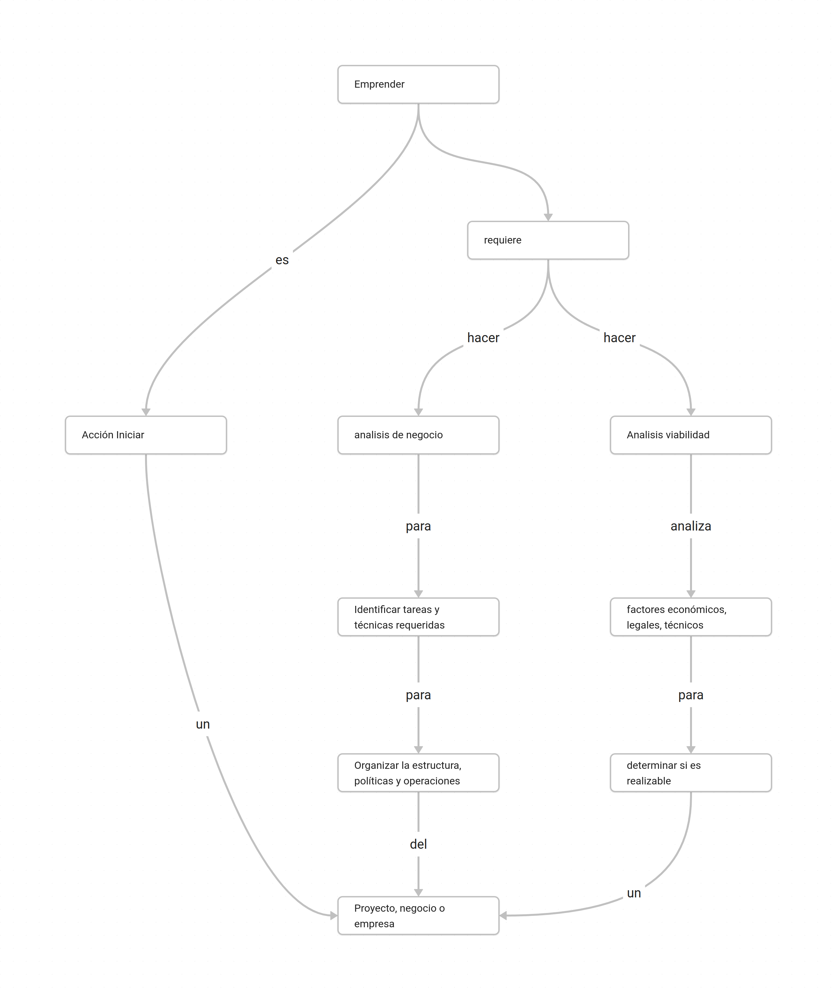

## Instrucciones
1. Mediante tu participación en el foro de discusión comparte el mapa conceptual al resto del grupo para su retroalimentación.
2. Asegúrate que el mapa conceptual responda a las preguntas: ¿qué es emprender?, ¿qué es el análisis de negocio? y ¿qué es el análisis de viabilidad?
3. Una vez que compartas tu documento da retroalimentación a por lo menos dos publicaciones.

## Mapa conceptual 
