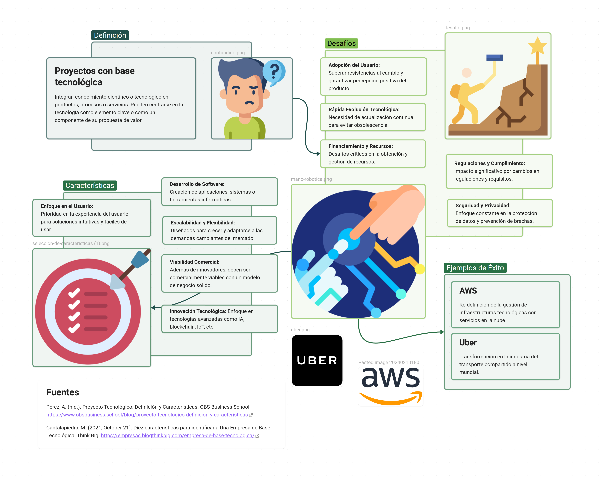

## Instrucciones 
**Investigación:** Utilizando fuentes de información confiable investiga qué es un proyecto con base tecnológica, identificando sus principales características, ventajas, desafíos y ejemplos de éxito. Algunas preguntas guía para la investigación podrían ser:

- ¿Cómo se define un proyecto con base tecnológica?
- ¿Cuáles son las características distintivas de estos proyectos?
- ¿Qué ejemplos de proyectos con base tecnológica han tenido éxito en el mercado actual?
- ¿Cuáles son los mayores desafíos que enfrentan estos proyectos?

**Creación de la Infografía:** Con la información recopilada, cada estudiante diseñará una infografía que resuma los puntos clave de su investigación. La infografía debe ser clara, visualmente atractiva y fácil de entender. 

Deberá incluir:

- Definición de proyecto con base tecnológica.
- Principales características.
- Ejemplos de proyectos exitosos.
- Desafíos comunes en este tipo de proyectos.

**Publicación en el Foro de Discusión:** Una vez creada la infografía, deberá participar en el foro de discusión creado para esta actividad.

Además de publicar su propio trabajo, se espera que cada alumno participe comentando al menos dos infografías de sus compañeros, ofreciendo retroalimentación constructiva, preguntas o puntos de vista adicionales para enriquecer la discusión. La participación en el foro debe ser respetuosa, constructiva y fomentar el intercambio de ideas.
###### Recomendaciones
- Asegúrate de citar todas tus fuentes de información para mantener la integridad académica.
- Al diseñar tu infografía, utiliza herramientas que te permitan crear diseños atractivos y profesionales, como Canva, Lucidchart, Piktochart, Adobe Spark, entre otros.
- En tus participaciones en el foro, intenta aportar valor agregado a la discusión, ya sea a través de preguntas que profundicen el tema, ofreciendo una perspectiva diferente o compartiendo recursos adicionales.

## Investigación 
### ¿Cómo se define un proyecto con base tecnológica?

-   Proyectos emprendedores con base tecnológica son aquellos que, de
    forma íntegra o parcial, hacen uso del conocimiento científico o
    tecnológico en la creación de sus productos, procesos o servicios,
    pudiendo ser este conocimiento el grosso del producto o tan solo una
    pequeña pincelada de lo que la oferta pretende sacar al
    mercado. Estos proyectos disponen de un componente tecnológico en su
    propuesta de valor o en los medios que utilizan para llegar a los
    usuarios, e incluso, en la infraestructura desarrollada para que el
    negocio funcione.

### ¿Cuáles son las características distintivas de estos proyectos?

-   **Desarrollo de software:** El núcleo del proyecto implica la creación
    de aplicaciones informáticas, sistemas, plataformas o herramientas
    de software que resuelvan problemas específicos, satisfagan
    necesidades del cliente o brinden servicios innovadores.

-   **Innovación tecnológica:** Los proyectos se caracterizan por su enfoque
    en la innovación y la aplicación de tecnologías de vanguardia, como
    inteligencia artificial, aprendizaje automático, blockchain,
    Internet de las cosas (IoT), realidad aumentada (AR) o realidad
    virtual (VR), entre otras.

-   **Escalabilidad y flexibilidad:** Los proyectos con base tecnológica
    están diseñados para ser escalables y adaptables, lo que significa
    que pueden crecer y evolucionar con el tiempo para satisfacer las
    demandas cambiantes del mercado y las necesidades de los clientes.

-   **Enfoque en el usuario:** Aunque la tecnología es fundamental, los
    proyectos exitosos también ponen un fuerte énfasis en la experiencia
    del usuario, asegurándose de que las soluciones tecnológicas sean
    intuitivas, fáciles de usar y satisfagan las expectativas del cliente.

-   **Viabilidad comercial:** Además de ser tecnológicamente innovadores,
    los proyectos con base tecnológica deben ser viables desde el punto
    de vista comercial, lo que significa que deben tener un modelo de
    negocio sólido, un mercado objetivo claro y una estrategia de
    monetización efectiva.

### ¿Qué ejemplos de proyectos con base tecnológica han tenido éxito en el mercado actual?

-   **Uber:** La aplicación de transporte compartido ha alterado la
    industria del taxi en todo el mundo, ofreciendo una forma
    conveniente de solicitar y pagar por servicios de transporte.

-   **Amazon Web Services (AWS):** AWS ha redefinido la forma en que las
    empresas gestionan la infraestructura tecnológica, ofreciendo
    servicios en la nube a escala mundial.

### ¿Cuáles son los mayores desafíos que enfrentan estos proyectos?

-   **Rápida Evolución Tecnológica:** La constante evolución de las
    tecnologías puede hacer que un proyecto quede obsoleto si no se
    actualiza de manera continua.

-   **Financiamiento y Recursos:** La obtención de financiamiento inicial
    y la gestión continua de recursos son desafíos críticos para muchos
    proyectos tecnológicos.

-   **Seguridad y Privacidad:** La creciente preocupación por la seguridad
    y la privacidad requiere enfoque constante para proteger datos y
    prevenir brechas de seguridad.

-   **Regulaciones y Cumplimiento:** Los cambios en regulaciones y
    requisitos de cumplimiento pueden impactar significativamente en el
    desarrollo y la implementación de proyectos tecnológicos.

-   **Adopción del Usuario:** Convencer a los usuarios para que adopten
    nuevas tecnologías puede ser un desafío importante, que implica
    superar resistencias al cambio y asegurar una percepción positiva
    del producto.

### Fuentes

    Pérez, A. (n.d.). Proyecto Tecnológico: Definición y Características. OBS Business School. https://www.obsbusiness.school/blog/proyecto-tecnologico-definicion-y-caracteristicas
    
    Cantalapiedra, M. (2021, October 21). Diez características para identificar a Una Empresa de Base Tecnológica. Think Big. https://empresas.blogthinkbig.com/empresa-de-base-tecnologica/

## Infografía
